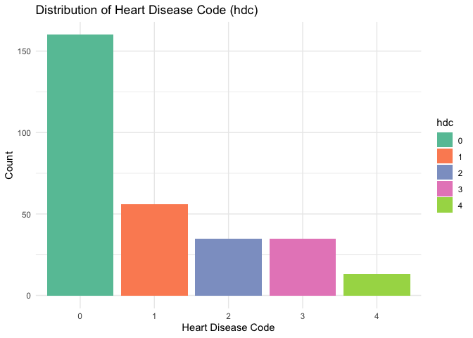
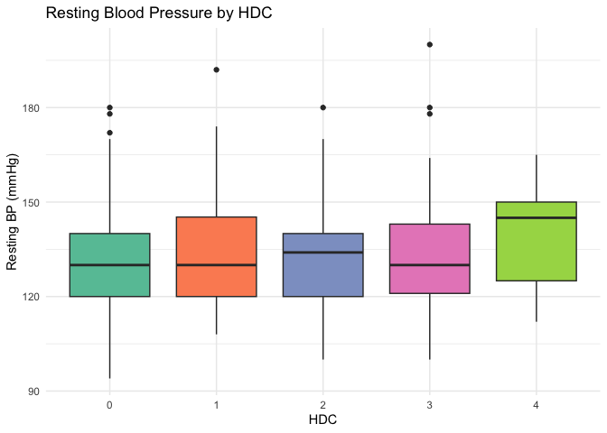
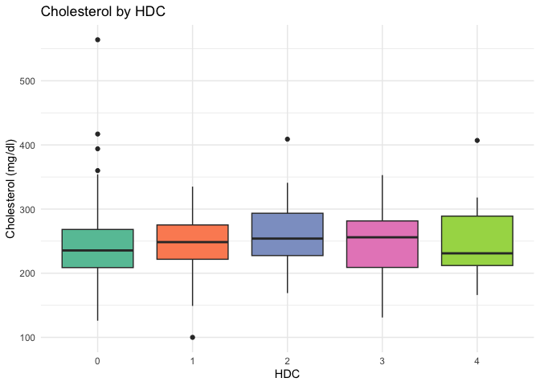
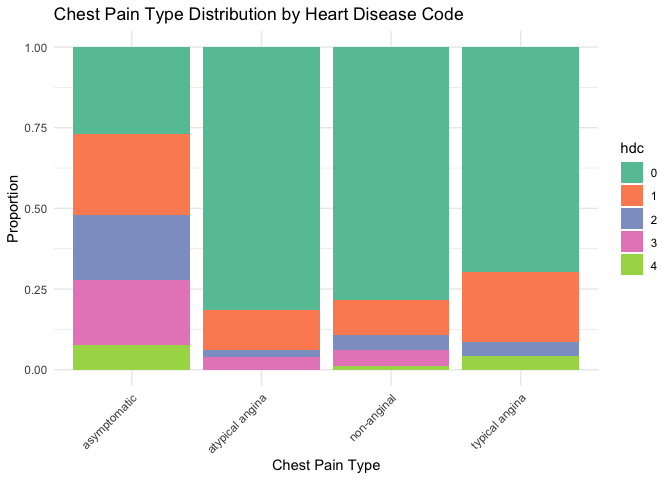
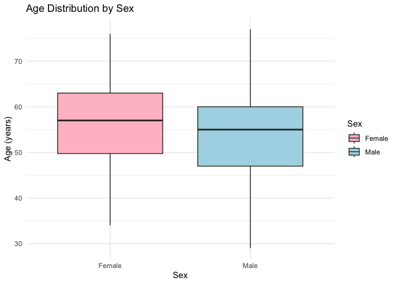

# Question 1: Heart Disease Prediction

## 1.1 Model Formalization

Multinomial logistic regression extends binary logistic regression to
handle more than 2 outcome categories. In our case, the response *Y* has
*K* = 5 categories (hdc = 0, 1, 2, 3, 4).

The model compares each category to a baseline (hdc = 0):

$$\log\left(\frac{P(Y=k)}{P(Y=0)}\right) = \beta\_{k0} + \beta\_{k1}X\_1 + \cdots + \beta\_{kp}X\_p, \quad k = 1, 2, \ldots, K-1$$

The probability of belonging to category *k* is:

$$P(Y=k|X) = \frac{e^{\beta\_{k0} + \beta\_k^T X}}{1 + \sum\_{j=1}^{K-1} e^{\beta\_{j0} + \beta\_j^T X}}$$

Difference from binary logistic regression:

- Binary logistic: 2 categories, one set of coefficients
- Multinomial: *K* categories, *K* − 1 sets of coefficients (each vs
  baseline)
- More parameters: (*K* − 1) × (*p* + 1) vs (*p* + 1)

## 1.2 Data Import and Preprocessing

    # load required libraries
    library(nnet)       # multinomial logistic regression
    library(ggplot2)    # visualization
    library(dplyr)      # data manipulation
    library(caret)      # cross-validation tools

    # import the dataset
    heart <- read.csv("db/heart.csv", stringsAsFactors = FALSE)
    str(heart)

    ## 'data.frame':    920 obs. of  15 variables:
    ##  $ age     : int  63 67 67 37 41 56 62 57 63 53 ...
    ##  $ sex     : chr  "Male" "Male" "Male" "Male" ...
    ##  $ place   : chr  "Cleveland" "Cleveland" "Cleveland" "Cleveland" ...
    ##  $ cp      : chr  "typical angina" "asymptomatic" "asymptomatic" "non-anginal" ...
    ##  $ trestbps: int  145 160 120 130 130 120 140 120 130 140 ...
    ##  $ chol    : int  233 286 229 250 204 236 268 354 254 203 ...
    ##  $ fbs     : logi  TRUE FALSE FALSE FALSE FALSE FALSE ...
    ##  $ restecg : chr  "lv hypertrophy" "lv hypertrophy" "lv hypertrophy" "normal" ...
    ##  $ thalch  : int  150 108 129 187 172 178 160 163 147 155 ...
    ##  $ exang   : logi  FALSE TRUE TRUE FALSE FALSE FALSE ...
    ##  $ oldpeak : num  2.3 1.5 2.6 3.5 1.4 0.8 3.6 0.6 1.4 3.1 ...
    ##  $ slope   : chr  "downsloping" "flat" "flat" "downsloping" ...
    ##  $ ca      : int  0 3 2 0 0 0 2 0 1 0 ...
    ##  $ thal    : chr  "fixed defect" "normal" "reversable defect" "normal" ...
    ##  $ hdc     : int  0 2 1 0 0 0 3 0 2 1 ...

    # convert categorical variables to factors
    heart$place <- as.factor(heart$place)
    heart$cp <- as.factor(heart$cp)
    heart$restecg <- as.factor(heart$restecg)
    heart$slope <- as.factor(heart$slope)
    heart$ca <- as.factor(heart$ca)
    heart$thal <- as.factor(heart$thal)
    heart$hdc <- as.factor(heart$hdc)

    # convert dichotomous to dummy (1/0)
    heart$sex <- ifelse(heart$sex == "Male", 1, 0)      # male=1, female=0
    heart$fbs <- ifelse(heart$fbs == TRUE, 1, 0)        # true=1, false=0
    heart$exang <- ifelse(heart$exang == TRUE, 1, 0)    # true=1, false=0

## 1.3 Data Inspection

    cat("Dataset dimensions:", nrow(heart), "observations,", ncol(heart), "variables")

    # check for missing values
    cat("Missing values per variable:")

    ## Missing values per variable:

    missing <- colSums(is.na(heart))
    print(missing[missing > 0])

    ## trestbps     chol      fbs  restecg   thalch    exang  oldpeak    slope 
    ##       59       30       90        2       55       55       62      309 
    ##       ca     thal 
    ##      611      486

    cat("Total missing values:", sum(is.na(heart)))

    ## Total missing values: 1759

    # remove rows with NA (in 'thal' variable)
    heart_clean <- na.omit(heart)
    cat("Clean dataset:", nrow(heart_clean), "obs (", nrow(heart) - nrow(heart_clean), "removed)")

    ## Clean dataset: 299 obs ( 621 removed)

**Preprocessing choices:**

- Removed rows with missing values (small proportion, imputation could
  bias results)
- No standardization needed for logistic regression

## 1.4 Visual Inspection

    # distribution of heart disease code
    ggplot(heart_clean, aes(x = hdc, fill = hdc)) +
      geom_bar() +
      labs(title = "Distribution of Heart Disease Code (hdc)",
           x = "Heart Disease Code", y = "Count") +
      theme_minimal() +
      scale_fill_brewer(palette = "Set2")

    # boxplot of resting blood pressure by hdc
    ggplot(heart_clean, aes(x = hdc, y = trestbps, fill = hdc)) +
      geom_boxplot() +
      labs(title = "Resting Blood Pressure by HDC",
           x = "HDC", y = "Resting BP (mmHg)") +
      theme_minimal() +
      scale_fill_brewer(palette = "Set2") +
      theme(legend.position = "none")

    # boxplot of cholesterol by hdc
    ggplot(heart_clean, aes(x = hdc, y = chol, fill = hdc)) +
      geom_boxplot() +
      labs(title = "Cholesterol by HDC",
           x = "HDC", y = "Cholesterol (mg/dl)") +
      theme_minimal() +
      scale_fill_brewer(palette = "Set2") +
      theme(legend.position = "none")

    # chest pain type by hdc
    ggplot(heart_clean, aes(x = cp, fill = hdc)) +
      geom_bar(position = "fill") +
      labs(title = "Chest Pain Type Distribution by Heart Disease Code",
           x = "Chest Pain Type", y = "Proportion") +
      theme_minimal() +
      scale_fill_brewer(palette = "Set2") +
      theme(axis.text.x = element_text(angle = 45, hjust = 1))

**Observations:**

- The target variable (hdc) shows class imbalance with hdc=0 being most
  frequent
- Resting blood pressure and cholesterol show some variation across hdc
  groups
- “Asymptomatic” chest pain is strongly associated with more severe
  disease

## 1.5 Age Distribution by Sex

    # boxplot of age by sex
    ggplot(heart_clean, aes(x = factor(sex, labels = c("Female", "Male")),
                            y = age, fill = factor(sex))) +
      geom_boxplot() +
      labs(title = "Age Distribution by Sex",
           x = "Sex", y = "Age (years)") +
      theme_minimal() +
      scale_fill_manual(values = c("pink", "lightblue"),
                        labels = c("Female", "Male"),
                        name = "Sex")

    # summary statistics by sex
    age_by_sex <- heart_clean %>%
      group_by(sex) %>%
      summarise(n = n(),
                mean_age = round(mean(age), 2),
                sd_age = round(sd(age), 2),
                median_age = median(age))
    age_by_sex$sex <- c("Female", "Male")
    print(age_by_sex)

    ## # A tibble: 2 × 5
    ##   sex        n mean_age sd_age median_age
    ##   <chr>  <int>    <dbl>  <dbl>      <dbl>
    ## 1 Female    96     55.8   9.42         57
    ## 2 Male     203     53.9   8.81         55

    # t-test for age difference between sexes
    t_test_result <- t.test(age ~ sex, data = heart_clean)
    print(t_test_result)

    ## 
    ##  Welch Two Sample t-test
    ## 
    ## data:  age by sex
    ## t = 1.5834, df = 175.72, p-value = 0.1151
    ## alternative hypothesis: true difference in means between group 0 and group 1 is not equal to 0
    ## 95 percent confidence interval:
    ##  -0.4458331  4.0640597
    ## sample estimates:
    ## mean in group 0 mean in group 1 
    ##        55.75000        53.94089

**Result:** The p-value is 0.1151. At *α* = 0.05, we fail to reject the
null hypothesis: no significant age difference between sexes.

## 1.6 Multinomial Regression - Full Model

We use the `multinom()` function from the `nnet` package to fit a
multinomial logistic regression model.

    # set reference level for hdc (no disease = 0)
    heart_clean$hdc <- relevel(heart_clean$hdc, ref = "0")

    # fit multinomial logistic regression with all predictors
    multinom_full <- multinom(hdc ~ age + sex + place + cp + trestbps + chol +
                              fbs + restecg + thalch + exang + oldpeak +
                              slope + ca + thal, data = heart_clean, trace = FALSE)

    # calculate z-values for interpretation
    z_values <- summary(multinom_full)$coefficients / summary(multinom_full)$standard.errors
    cat("Z-values (first 8 columns):")

    ## Z-values (first 8 columns):

    print(round(z_values[, 1:8], 3))

    ##   (Intercept)    age   sex placeHungary placeSwitzerland placeVA Long Beach
    ## 1      -1.922 -0.674 2.992    216277.44                0           315396.1
    ## 2      -2.213 -0.247 2.069   -219009.79                0          -364691.9
    ## 3       0.720 -2.412 1.884   -606436.62              NaN          -885238.7
    ## 4     -57.995  0.819 2.707    -48511.49              NaN          -169117.4
    ##   cpatypical angina cpnon-anginal
    ## 1            -1.446        -3.062
    ## 2            -1.313        -3.141
    ## 3             0.571        -1.581
    ## 4      -1703191.631        -3.044

**Interpretation:**

- Each row represents log-odds of that category vs baseline (hdc=0)
- Positive coefficients increase the probability of that disease
  category
- Key predictors with strong effects: `cp` (chest pain type), `ca`
  (number of vessels), `thal`

## 1.7 Cross-Validation

**Error measure:** We use the misclassification error rate, defined as:

$$\text{Error Rate} = \frac{1}{n}\sum\_{i=1}^{n} I(y\_i \neq \hat{y}\_i)$$

where *I*(⋅) is the indicator function.

### CV Method Selection

    # seed based on birthday closest to august 21: filippo parissi (25/08/2005)
    # august 25 is only 4 days from august 21
    set.seed(25082005)

    cv_methods <- c("1. Vanilla validation set", "2. LOO-CV",
                    "3. K-fold CV (K=5)", "4. K-fold CV (K=10)")
    selected_method <- sample(cv_methods, 1)
    cat("Selected CV method:", selected_method)

    ## Selected CV method: 1. Vanilla validation set

### Implementation

    # function to calculate misclassification error
    calc_error <- function(actual, predicted) {
      mean(actual != predicted)
    }

    set.seed(123)
    n <- nrow(heart_clean)

    # vanilla validation set approach (80/20 split)
    train_idx <- sample(1:n, 0.8 * n)
    train_data <- heart_clean[train_idx, ]
    val_data <- heart_clean[-train_idx, ]

    cat("Training set size:", nrow(train_data))

    ## Training set size: 239

    cat("Validation set size:", nrow(val_data))

    ## Validation set size: 60

    # fit model on training data
    model_val <- multinom(hdc ~ age + sex + place + cp + trestbps + chol + fbs + restecg +
                          thalch + exang + oldpeak + slope + ca + thal,
                          data = train_data, trace = FALSE)

    # predict on validation set
    pred_val <- predict(model_val, newdata = val_data)
    cv_error <- calc_error(val_data$hdc, pred_val)

    cat("Validation Set Results:")

    ## Validation Set Results:

    cat("Error Rate:", round(cv_error, 4))

    ## Error Rate: 0.4

    cat("Accuracy:", round(1 - cv_error, 4))

    ## Accuracy: 0.6

## 1.8 Model Improvement

We attempt to improve the model by selecting only the most important
predictors based on the initial analysis.

    library(MASS)

    # reduced model with key predictors
    multinom_reduced <- multinom(hdc ~ sex + cp + thalch + exang + oldpeak + ca + thal,
                                 data = heart_clean, trace = FALSE)

    # compare AIC (lower is better)
    cat("AIC Comparison:")

    ## AIC Comparison:

    cat("Full Model AIC:", round(AIC(multinom_full), 2))

    ## Full Model AIC: 617.93

    cat("Reduced Model AIC:", round(AIC(multinom_reduced), 2))

    ## Reduced Model AIC: 592.92

    # cross-validate the reduced model
    model_red <- multinom(hdc ~ sex + cp + thalch + exang + oldpeak + ca + thal,
                          data = train_data, trace = FALSE)
    pred_red <- predict(model_red, newdata = val_data)
    cv_error_reduced <- calc_error(val_data$hdc, pred_red)

    cat("Cross-Validation Comparison:")

    ## Cross-Validation Comparison:

    cat("Full Model CV Error:", round(cv_error, 4))

    ## Full Model CV Error: 0.4

    cat("Reduced Model CV Error:", round(cv_error_reduced, 4))

    ## Reduced Model CV Error: 0.3667

    cat("Better model based on CV:", ifelse(cv_error_reduced < cv_error, "Reduced", "Full"))

    ## Better model based on CV: Reduced

**Model Selection Strategy:**

- Compare models using both AIC and cross-validated error
- Lower AIC indicates better in-sample fit with complexity penalty
- Lower CV error indicates better generalization to new data

## 1.9 Binary Logistic Regression

We create a binary response variable `hdc01` where 0 = no disease
(hdc=0) and 1 = any disease (hdc=1,2,3,4).

    # create binary response
    heart_binary <- heart_clean
    heart_binary$hdc01 <- ifelse(heart_clean$hdc == "0", 0, 1)

    cat("Binary response distribution:")

    ## Binary response distribution:

    table(heart_binary$hdc01)

    ## 
    ##   0   1 
    ## 160 139

    cat("Proportions:")

    ## Proportions:

    prop.table(table(heart_binary$hdc01))

    ## 
    ##         0         1 
    ## 0.5351171 0.4648829

    # fit binary logistic regression
    logit_full <- glm(hdc01 ~ age + sex + place + cp + trestbps + chol + fbs + restecg +
                      thalch + exang + oldpeak + slope + ca + thal,
                      data = heart_binary, family = binomial)

    # extract significant predictors (p < 0.05)
    coef_summary <- summary(logit_full)$coefficients
    significant <- coef_summary[coef_summary[, 4] < 0.05, ]

    cat("Significant predictors (p < 0.05):")

    ## Significant predictors (p < 0.05):

    print(rownames(significant))

    ## [1] "sex"                   "cpnon-anginal"         "cptypical angina"     
    ## [4] "trestbps"              "ca1"                   "ca2"                  
    ## [7] "ca3"                   "thalreversable defect"

**Interpretation:** The significant predictors are those that
meaningfully contribute to predicting heart disease presence vs absence.

## 1.10 Model Comparison

    # multinomial model accuracy
    pred_multinom <- predict(multinom_full, newdata = heart_clean)
    acc_multinom <- mean(pred_multinom == heart_clean$hdc)

    # binary logistic model accuracy
    prob_logit <- predict(logit_full, type = "response")
    pred_logit <- ifelse(prob_logit > 0.5, 1, 0)
    acc_logit <- mean(pred_logit == heart_binary$hdc01)

    cat("In-sample Accuracy Comparison:")

    ## In-sample Accuracy Comparison:

    cat("Multinomial Model:", round(acc_multinom, 4))

    ## Multinomial Model: 0.6957

    cat("Binary Logistic Model:", round(acc_logit, 4))

    ## Binary Logistic Model: 0.8696

    # confusion matrix for multinomial model
    cat("Multinomial Model Confusion Matrix:")

    ## Multinomial Model Confusion Matrix:

    print(table(Predicted = pred_multinom, Actual = heart_clean$hdc))

    ##          Actual
    ## Predicted   0   1   2   3   4
    ##         0 151  23   1   1   1
    ##         1   6  17  10   7   4
    ##         2   2   9  16   6   1
    ##         3   1   5   4  20   3
    ##         4   0   2   4   1   4

    # confusion matrix for binary logistic model
    cat("Binary Logistic Model Confusion Matrix:")

    ## Binary Logistic Model Confusion Matrix:

    print(table(Predicted = pred_logit, Actual = heart_binary$hdc01))

    ##          Actual
    ## Predicted   0   1
    ##         0 146  25
    ##         1  14 114

Analysis:

The binary model shows higher accuracy (0.8696) compared to the
multinomial model (0.6957). However this comparison is not meaningful
because the two models solve fundamentally different problems: the
multinomial model predicts disease severity across 5 levels while the
binary model only predicts presence or absence. The binary approach
aggregates all disease levels into a single category losing valuable
clinical information about severity. Distinguishing between 2 classes is
inherently easier than 5, so higher accuracy does not indicate a better
model. If disease severity matters for clinical decisions the
multinomial model remains more informative despite its lower accuracy.
